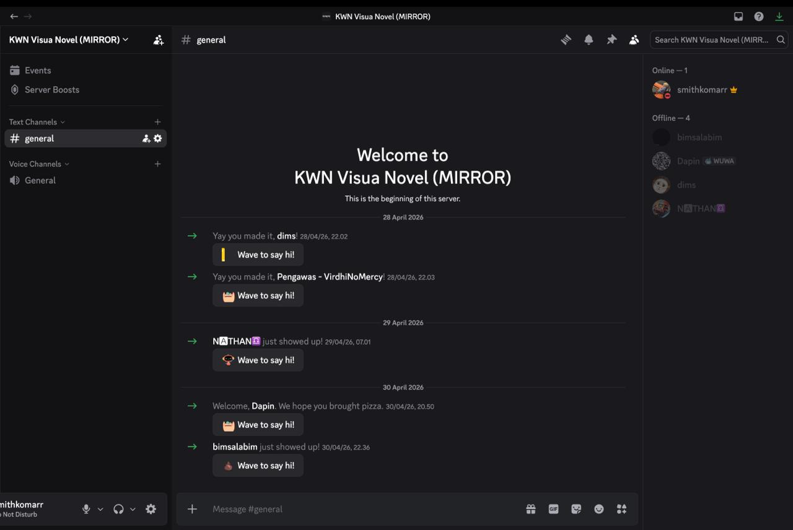
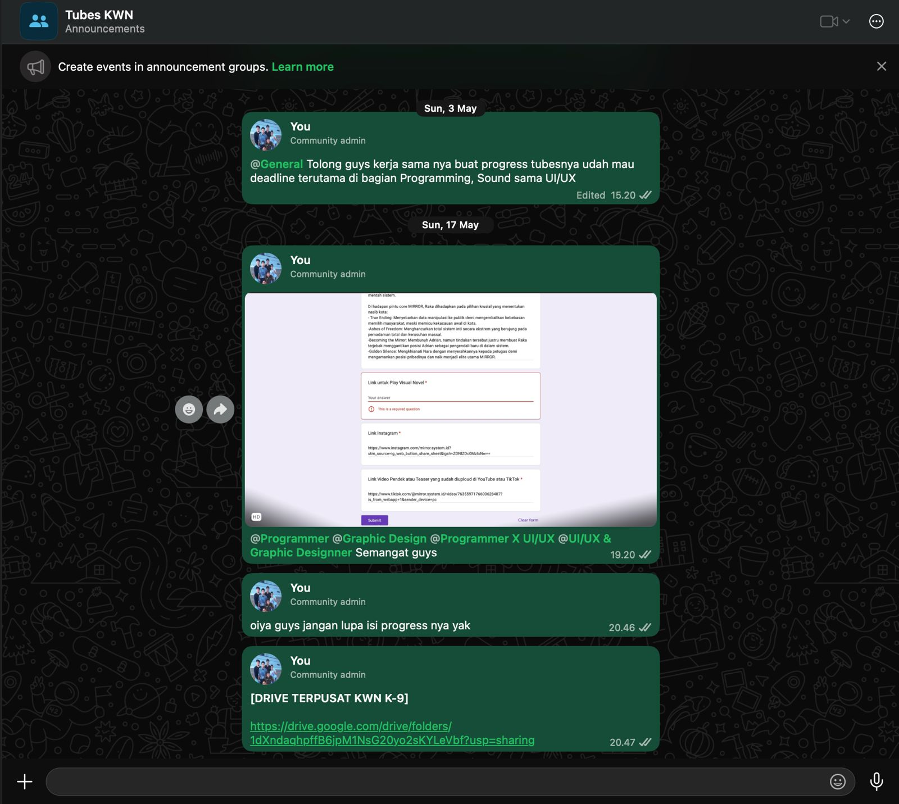

## Kompetensi target

Membedakan person, personality, dan character serta memilih objective, repertoire, dan language yang sesuai.

## Evidence wajib

- Lima character dari sedikitnya tiga domain kehidupan.
- Objective, responsibility, repertoire, dan risiko tiap character.
- Satu contoh perubahan language ketika character berubah.

## Lima Character
| Domain dan character | Person & relationship | Objective & responsibility | Repertoire & language | Risiko dan latihan |
| :--- | :--- | :--- | :--- | :--- |
| Intra - Self - Reflective Learner | Diri sendiri saat melakukan review ulang materi perkuliahan (Matematika Diskrit). | Memahami materi lebih dalam (logika) sebelum melanjutkannya ke materi selanjutnya ataupun sebagai perisiapan untuk quiz. | Self-talk analitis dan pembuktian bertahap; "Kalau ekuivalensi logika ini diterapkan ke dalam kondisi if-else di program, jadinya seperti apa ya? Coba aku buktikan pakai tabel kebenaran dulu." | Terlalu fokus untuk menghafal rumus tanpa memahami makna penggunaannya; Latihan Selalu kaitkan setiap notasi abstrak dengan contoh kalimat dunia nyata atau algoritma. |
| Friends - Teman sebaya | Teman satu kelompok tugas besar PSTI. | Menjaga alur kerja, adil dalam pembagian tugas, menjaga solidaritas, dan melepas penat setelah tugas selesai. | Santai, empatik; "Ayo kita istirahat dulu sebelum milestone selanjutnya rilis." | Terlalu cepat memberi saran saat teman mengeluh; Latihan: Dengarkan masukan dan pendapat dari temen terlebih dahulu tanpa memotong. |
| Family - Adik | Adik yang sedang mempertimbangkan untuk memilih jurusan di SMA. | Membantu adik dalam proses pengambilan keputusan, memberikan dukungan emosional, dan menjadi teladan yang baik. | Empatik, sabar; "Aku paham kamu sedang bingung, mari kita bahas bersama-sama." | Terlalu sering memaksa adik untuk mengikuti pilihan saya; Latihan: Dengarkan pendapat adik dan hormati keputusannya. |
| Community - Staff Logistik (Anggota panitia) | Staff logistik dalam sebuah panitia kegiatan. | Menjaga komunikasi yang baik dengan tim, memastikan semua persiapan berjalan lancar, dan memberikan dukungan kepada anggota panitia lainnya. | Profesional, responsif; "Ayo kita koordinasi lagi supaya semua bisa berjalan mulus." | Terlalu mudah terpengaruh oleh tekanan waktu; Latihan: Prioritaskan tugas berdasarkan urgensi dan dampaknya. 
| Work / Academic — Project Manager | Anggota tim multidisiplin (Programmer, UI/UX, Sound Designer, Graphic Designer, Script Writer, dll) | Mengarahkan visi proyek (tema, konsep, alur) dan menyinkronkan ritme kerja antar divisi agar visual novel selesai sesuai target waktu dan tujuan mata kuliah. | Asertif dan fasilitatif; "Bagaimana progres aset karakter dari tim desainer? Apakah ada kendala saat script cerita ini mau diintegrasikan ke engine oleh programmer?" | Terjebak micromanaging atau memaksakan visi cerita terlalu kaku; Latihan: Delegasikan otonomi teknis kepada spesialis di divisi masing-masing dan biasakan bertanya "Apa blocker terbesarmu saat ini yang bisa aku bantu selesaikan?". |

## Episode yang dianalisis

**Konteks:** Implementasi percabangan cerita Bab 1 ke *engine* Ren'Py terlambat empat hari dari jadwal internal. Awalnya muncul praduga bahwa Budi "kurang komitmen dan menyepelekan tanggung jawab". Itu adalah *story*, bukan fakta. Fakta yang tersedia baru satu: *build* narasi di *repository* belum diperbarui sesuai tanggal kesepakatan.

**Objective:** Beralih dari asumsi "kurang komitmen" menuju penggalian hambatan nyata tanpa membuat lawan bicara defensif, serta menyepakati pembagian alur kerja dan tenggat baru yang realistis sambil menjaga hubungan kerja tim.

> **Azka (PM):** "Dimas, progres *build* untuk cabang narasi Bab 1 belum ter-*update* di *repository*. Boleh ceritakan apa kendala teknis yang sedang kamu hadapi saat memasukkan *script*-nya?"  
> **Dimas:** "*Script* dialognya banyak teks *formatting* khusus yang bikin *parser* di *engine*-nya terus-menerus *error*, jadi aku harus bersihin manual satu per satu."  
> **Azka (PM):** "Paham, jadi hambatan utamanya ada di ketidaksesuaian format teks dari *script writer* ke *script engine*, betul begitu?"  
> **Dimas:** "Iya, betul. Ditambah minggu ini ada responsi praktikum, jadi waktuku habis di situ."  
> **Azka (PM):** "Oke, ini masalah format data, bukan lambat kerja. Supaya kamu tidak *overload*, ada dua opsi: *script writer* yang kita minta rapikan format teksnya dari awal, atau kita sederhanakan format dialognya dulu untuk demo ini. Menurutmu opsi mana yang paling cepat jalan?"  
> **Dimas:** "Lebih aman *script writer*-nya yang merapikan format teksnya dulu sebelum dioper ke aku."  

Response Dimas mengubah *repertoire* saya dari menagih tenggat menjadi *problem-solving* bersama. *Agreement* akhirnya: Saya membuat *template* format teks baru di Google Docs untuk *script writer* malam itu juga, dan Dimas menyanggupi integrasi rampung dalam 2 hari setelah naskah rapi diterima.

## Perubahan language

Sebagai **teman sebaya**, saya akan berkata, "Ayo kita istirahat dulu hari ini, jangan dipaksain biar nggak *burnout*, nanti kita gas lagi." Sebagai **Project Manager**, saya berkata, "Target rilis demo visual novel tinggal dua minggu lagi; bagian *script* mana yang saat ini jadi kendala dan butuh kita selesaikan bersama?" *Core care* tetap ada, tetapi *responsibility* dan *action* berbeda.

## Konteks performance

**Tanggal dan setting:** 3 Mei 2026, Diskusi berkala malalui voice call Discord Kelompok Tugas Besar Visual Novel Game.

**Persons dan relationship:** Dimas, rekan satu angkatan yang bertugas sebagai programmer integrasi di engine game. Hubungan pertemanan sebaya yang dalam proyek ini memiliki relasi kerja sebagai Project Manager dan tim teknis.

**Objective dan initial state:** Nyatakan perubahan yang ingin dicapai serta evidence state awal.

## Evidence

::: {.evidence-block}

:::

## Analisis komunikasi

| Elemen                | Evidence dan analisis       |
| --------------------- | --------------------------- |
| Person & character    | Dimas diposisikan sebagai "rekan dengan *blocker* teknik", bukan dilabeli "kurang komitmen". Terjadi **pergeseran peran**: awalnya saya memegang awalnya saya memegang *power* otoritatif sebagai Project Manager penagih tenggat waktu, lalu secara sadar merendahkan *power* tersebut untuk setara dengan Dimas, memberinya ruang sebagai ahli teknis untuk merumuskan akar masalah. |
| Objective & state     | Ada **objective yang saling bersaing**: saya sebagai PM ingin mengejar *timeline* integrasi *script* ke *engine*, sementara Dimas memiliki *objective* bertahan dari tekanan beban akademik (responsi praktikum) agar tidak *burnout*. *State* berhasil diubah dari ketegangan (keterlambatan) menjadi kompromi jadwal yang mempertemukan kedua *objective* tersebut. |
| Repertoire & language | Bahasa instruktif diubah menjadi eksploratif. Penggunaan *paraphrase* ("Oh, jadi hambatan utamanya ada di ketidaksesuaian format teks...") terbukti valid menurunkan sikap defensif lawan bicara dan membuka ruang diskusi logis. |
| Response & adaptation | Adaptasi terjadi secara lincah. Fakta baru (kesulitan *troubleshoot* format teks manual) langsung mengubah arah pembicaraan di detik itu juga; dari sekadar menuntut hasil menjadi memodifikasi alur kerja (merapikan naskah di hulu lewat *script writer*). |
| Agreement/action      | Disepakati pembuatan *template* naskah baru dan tenggat integrasi diubah menjadi 2 hari setelah naskah rapi diterima. *Ownership* masalah kini diselesaikan secara kolaboratif lintas divisi. |
| Relationship outcome  | Risiko konflik terbuka berhasil dihindari. Rasa saling percaya (*trust*) justru meningkat karena terbentuk rasa aman (*psychological safety*); anggota tim tahu mereka bisa jujur tentang kendala (termasuk tugas kuliah) tanpa langsung dihakimi. |

## Penggunaan AI

Nyatakan `Tidak menggunakan AI` atau jelaskan:

- alat dan peran AI: Gemini untuk memandu alur pengerjaan tugas dan alur pembuatan code yang akan dibuat di quarto portofolio.
- prompt atau instruksi penting: "Buatkan contoh percakapan yang menunjukkan perubahan *repertoire* dan *language* ketika *character* berubah dari teman sebaya menjadi rekan kerja dalam proyek".
- bagian output yang digunakan, diubah, atau ditolak;
- pemeriksaan accuracy, privacy, dan authority: Memeriksa data pribadi rekan agar tidak terbuka di publik, memeriksa fakta dan referensi yang digunakan, serta menilai apakah saran AI sesuai konteks.
- apa yang tetap Anda pelajari sebagai manusia: Memahami konteks komunikasi, menilai niat dan emosi lawan bicara, serta menyesuaikan *language* dan *repertoire* agar tetap menjaga hubungan kerja yang sehat.

## Feedback dan tindak lanjut

**Feedback yang diterima:** Rekan tim lain mencatat bahwa meskipun saya sudah menggunakan pertanyaan terbuka, nada intonasi suara saya di awal percakapan masih terdengar sedikit mendesak.

**Adaptation/replay:** Kedepanya, saya akan menambahkan jeda sebelum bertanya dan menekankan empati di awal percakapan agar lawan bicara merasa lebih nyaman.

**Next practice:** Menerapkan 5 detik jeda sebelum bertanya dan menekankan empati di awal percakapan, serta meminta umpan balik dari rekan tim setelah percakapan untuk memastikan nada suara saya terdengar lebih ramah dan tidak mendesak.

## Self-assessment

| Dimensi                          | Skor 1–4 | Evidence singkat |
| -------------------------------- | --------: | ---------------- |
| Person & Character               |        4 | Fakta dipisahkan dari opini secara sadar. Dinamika pergeseran dianalisis eksplisit.               |
| Objective & State                |        4 | Sukses menavigasi competing objectives hingga mencapai solusi kolaboratif.               |
| Repertoire, Language & AI        |        4 | Bahasa paraprhase berhasil meredakan tensi; AI digunakan sebagai asisten simulasi dan formatting secara kritis dengan batasan manusia yang jelas.               |
| Response & Adaptation            |        4 | Informasi hambahatan baru secara proaktif merombak struktur pembagian kerja (*actionable options*) seketika.                |
| Agreement, Action & Relationship |        4 | Kesepakatan tenggat waktu baru dan tanggung jawab lintas divisi tercatat jelas, trust dalam                |

**Total:** 20 / 20

::: {.assessor-only}

### Assessment dosen

**Skor:** — / 20
**Evidence yang mendukung:** —
**Prioritas perbaikan:** —
**Keputusan:** Belum dinilai / Perlu revisi / Tercapai
:::